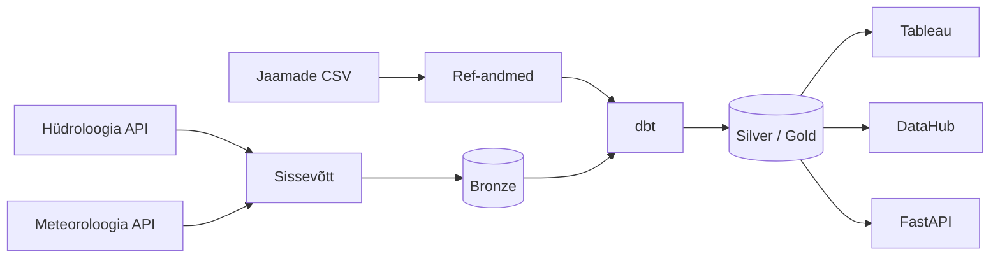

# Eesti hüdroloogilise seire andmetorustik

## Äriküsimus

Kuidas mõjutavad sademed ja õhutemperatuur veetaseme kõikumisi seirejaamades ning millised keskkonnategurid (õhutemperatuur, sademed) avaldavad veetaseme muutusele kõige tugevamat mõju?

**Mõõdikud:**

1. Veetase (cm) hüdromeetriajaamade kaupa — keskmine, miinimum, maksimum tunni kohta
2. Sademete hulk (mm) ja õhutemperatuur lähima meteoroloogijaama järgi

## Arhitektuur



Täpsem kirjeldus: [`docs/arhitektuur.md`](docs/arhitektuur.md)

## Andmestik

| Allikas | Tüüp | Ajas muutuv? | Roll |
|---------|------|--------------|------|
| Hüdroloogia API (`f_hydroseire`) | REST API (PostgREST) | Jah, tunnipõhine (~43h viivitus) | Veetase, temperatuur, äravool — 76 jaama |
| Meteoroloogia API (`f_kliima_tund`) | REST API (PostgREST) | Jah, iga päev (pakettöötlus ~05:01 EET) | Sademed, temperatuur, tuul, lumikate — 25 jaama |
| Hüdromeetria jaamad (`seeds/hydrometric_stations.csv`) | CSV / seed | Ei, staatiline | 76 jaama metaandmed koos kõrgusega MSL |
| Meteoroloogia jaamad (`seeds/meteorological_stations.csv`) | CSV / seed | Ei, staatiline | 25 jaama metaandmed |
| Seirejaamade vahekaugus | Automaatselt genereeritud (Haversine) | Ei (uuendatakse jaamade muutumise korral) | 3 lähimat meteojaam iga hüdrojaama kohta |

## Tehnoloogiavirn (stack)

| Komponent | Tööriist | Versioon | RAM | Ketas |
|-----------|---------|---------|-----|-------|
| Orkestreerimine | Apache Airflow (TaskFlow API) | 3.2.1 | ~2 GB | ~1 GB |
| Transformatsioon | dbt Core + dbt-utils | 1.9.x | ~256 MB | ~256 MB |
| Andmehoidla | PostgreSQL analytics-db (pgduckdb) | 16 | ~2 GB | ~10 GB |
| Andmehoidla | PostgreSQL airflow-db + superset-db | 16 | ~512 MB | ~512 MB |
| Näidikulaud | Tableau | — | — | — |
| Näidikulaud | Apache Superset | 6.0.1 | ~1 GB | ~512 MB |
| Andmekataloog | DataHub | head (latest) | ~6 GB | ~3 GB |
| Avalik REST API | FastAPI + asyncpg + slowapi | 0.115.6 | ~256 MB | ~256 MB |
| Toordata + arhiiv | /data/raw + /data/archive | — | — | ~1 GB |
| Konteinerimine | Docker Compose | — | — | — |
| Keel | Python 3 | 3.12 | — | — |
| Versioonikontroll | Git / GitHub | — | — | — |
| **Kokku** | | | **~12 GB** | **~16 GB** |

> Mõõdetud Dell PowerEdge T640, Ubuntu 24.04, täieliku backfilliga (alates 2025-01-01). Analytics-db ketta kasutus kasvab koos andmemahuga. DataHub domineerib RAM-i kasutuses — OpenSearch ja GMS moodustavad suurema osa ~6 GB-st.

## Käivitamine

```bash
# 1. Klooni repo ja liigu kausta
git clone https://github.com/SyncMaster7/deng-hydro-climate.git
cd deng-hydro-climate

# 2. Kopeeri keskkonnamuutujad
cp .env.example .env
# Muuda .env failis paroolid ja muud seaded vastavalt vajadusele

# 3. Käivita teenused
docker compose up -d --build

# 4. Installi dbt paketid
docker exec -it deng-dbt dbt deps \
  --project-dir /dbt \
  --profiles-dir /dbt

# 5. Käivita seed DAG (jaamade andmed ja läheduse arvutus)
# Airflow UI-s: käivita käsitsi seed_stations DAG
```

**Teenuste aadressid:**

| Teenus | Avalik URL | Lokaalne arendus |
|--------|-----------|-----------------|
| Airflow UI | https://airflow.deng.ee | http://localhost:8080 |
| Superset | https://superset.deng.ee | http://localhost:8088 |
| DataHub | https://datahub.deng.ee | http://localhost:9002 |
| FastAPI / Swagger | https://api.deng.ee/docs | http://localhost:8000/docs |

## Saladused ja konfiguratsioon

Kõik saladused (paroolid, API võtmed, andmebaasi URL-id) on `.env` failis. Repos on ainult `.env.example`, mis näitab vajalike muutujate struktuuri ilma tegelike väärtusteta. Päris `.env` faili ei tohi GitHubi panna — see on `.gitignore`-s.

## Andmevoog lühidalt

1. **Toomine** — `fetch_hydro` ja `fetch_meteo` tõmbavad Keskkonnaagentuuri API-st tunnipõhised andmed (viivitus ~43h) ja salvestavad JSON-failidena `/data/raw/` alla
2. **Laadimine** — `ingest_hydro` ja `ingest_meteo` loevad JSON-failid, teevad UPSERT `bronze` skeemi (`bronze.hydro`, `bronze.meteo`)
3. **Transformatsioon** — `run_dbt` käivitab `dbt build`: `silver` kiht puhastab ja teisendab laiaks, `gold` kiht ühendab hüdro- ja meteoandmed lähima jaama järgi
4. **Testimine** — `dbt build` käivitab automaatselt 26 andmekvaliteedi testi bronze kihi vastu (16 geneerist + 10 singulaarset); ebaõnnestumine peatab silver/gold/api mudelite ehitamise
5. **Väljund** — Tableau ühendub otse andmebaasiga (`gold` kiht) ja kuvab veetaseme ning ilmaandmete analüüsi; FastAPI (`api.deng.ee`) publitseerib andmed avaliku REST API kaudu

## Andmekvaliteedi testid

dbt käivitab 26 testi iga `dbt build` jooksul automaatselt. Kõik testid on bronze kihi vastu — silver, gold ja api mudelid ehitatakse ainult siis, kui kõik testid läbivad.

**Geneerilised testid (16)** — defineeritud `models/sources/sources.yml`:

| Tabel | Test | Veerud |
|-------|------|--------|
| `bronze.hydro` | `not_null` | `jaam_kood`, `timeline_ts_utc`, `timeline_ts_local`, `aegrida_nimi`, `loaded_at` |
| `bronze.hydro` | `accepted_values` | `aegrida_nimi` — 9 teadaolevat mõõtmistüüpi |
| `bronze.hydro` | `unique_combination_of_columns` | `(jaam_kood, timeline_ts_utc, aegrida_nimi)` |
| `bronze.meteo` | `not_null` | `jaam_kood`, `aasta`, `kuu`, `paev`, `tund`, `element_kood`, `loaded_at` |
| `bronze.meteo` | `accepted_values` | `element_kood` — 10 teadaolevat elemendi koodi |
| `bronze.meteo` | `unique_combination_of_columns` | `(jaam_kood, aasta, kuu, paev, tund, element_kood)` |

**Singulaarset testid (10)** — defineeritud `tests/`:

| Test | Kirjeldus |
|------|-----------|
| `bronze_hydro_wl_range` | Veetase vahemikus -100 kuni 1500 cm |
| `bronze_hydro_wt_range` | Veetemperatuur vahemikus -5 kuni 35°C |
| `bronze_hydro_discharge_range` | Äravool vahemikus -300 kuni 15 000 m³/s (negatiivsed väärtused lubatud rannikujaamades) |
| `bronze_hydro_no_future_timestamps` | `timeline_ts_utc` ei tohi olla tulevikus |
| `bronze_meteo_temperature_range` | Õhutemperatuur (TA, TAN1H, TAX1H) vahemikus -40 kuni 35°C |
| `bronze_meteo_precipitation_non_negative` | Sademed (PR1H) ≥ 0 mm |
| `bronze_meteo_humidity_range` | Suhteline niiskus (RH) vahemikus 0 kuni 100% |
| `bronze_meteo_pressure_range` | Õhurõhk (PA0) vahemikus 950 kuni 1060 hPa |
| `bronze_meteo_wind_speed_non_negative` | Tuule kiirus (WS10M, WSX1H) ≥ 0 m/s |
| `bronze_meteo_tund_range` | Tund vahemikus 0 kuni 23 |

> SDUR1H (päikesepaiste kestus) on bronze kihis teadlikult testimata — allikast pärinevad negatiivsed väärtused on teadaolev sensorikalibreerimise artefakt ning säilitatakse bronze'is täpse sisselaadimise põhimõttel.

Testide käivitamine käsitsi:
```bash
docker exec -it deng-dbt dbt test \
  --select source:bronze \
  --project-dir /dbt \
  --profiles-dir /dbt \
  --log-path /tmp/dbt_logs \
  --target-path /tmp/dbt_target
```

## Projekti struktuur

```
.
├── README.md
├── docker-compose.yml
├── .env.example
├── .gitignore
├── dags/
│   ├── hydro_meteo_pipeline.py         ← põhiline igapäevane pipeline
│   ├── seed_stations.py                ← jaamade seemneandmed ja läheduse arvutus
│   ├── archive_raw_files.py            ← nädalane arhiveerimine
│   └── datahub_refresh_dbt_metadata.py ← DataHub dbt metaandmete uuendamine
├── dbt_project/
│   ├── dbt_project.yml
│   ├── packages.yml                    ← dbt-utils pakett (composite unique testid)
│   ├── profiles.yml
│   ├── macros/
│   │   └── generate_schema_name.sql
│   ├── models/
│   │   ├── api/                        ← FastAPI serveerimiskiht (5 mudelit)
│   │   ├── gold/
│   │   │   └── hydro_meteo.sql
│   │   ├── silver/
│   │   │   ├── hydro.sql
│   │   │   └── meteo.sql
│   │   └── sources/
│   │       └── sources.yml             ← allikad + geneerilised testid
│   ├── snapshots/
│   │   ├── snap_hydro_stations.sql
│   │   └── snap_meteo_stations.sql
│   └── tests/                          ← singulaarset testid (10 faili)
│       ├── bronze_hydro_wl_range.sql
│       ├── bronze_hydro_wt_range.sql
│       ├── bronze_hydro_discharge_range.sql
│       ├── bronze_hydro_no_future_timestamps.sql
│       ├── bronze_meteo_temperature_range.sql
│       ├── bronze_meteo_precipitation_non_negative.sql
│       ├── bronze_meteo_humidity_range.sql
│       ├── bronze_meteo_pressure_range.sql
│       ├── bronze_meteo_wind_speed_non_negative.sql
│       └── bronze_meteo_tund_range.sql
├── docker/
│   ├── airflow/
│   │   └── Dockerfile
│   ├── datahub-actions/
│   │   └── Dockerfile
│   ├── fastapi/
│   │   ├── Dockerfile
│   │   ├── main.py
│   │   └── requirements.txt
│   └── superset/
│       ├── Dockerfile
│       └── superset_config.py
├── datahub/
│   ├── artifacts/                      ← dbt artefaktid DataHubi jaoks
│   └── recipes/                        ← DataHub ingestion retseptid
│       ├── dbt_recipe.yml
│       ├── postgres_recipe.yml
│       └── superset_recipe.yml
├── docs/
│   └── arhitektuur.md
├── ingestion/
│   └── haversine.py                    ← kauguse arvutus
├── seeds/
│   ├── hydrometric_stations.csv
│   ├── meteorological_stations.csv
│   └── station_proximity.csv
└── sql/
    ├── create_tables.sql
    └── migrate_etl_log.sql
```

## Kokkuvõte, puudused ja võimalikud edasiarendused

**Kokkuvõte:**
- Täielik andmetorustik hüdro- ja meteoandmete igapäevaseks töötluseks on töökorras
- Backfill kaetud alates 2025-01-01 — ~7,8M rida hüdro ja ~2,9M rida meteo andmeid
- Superset dashboard on avaldatud kolme graafikuga
- DataHub andmekataloog toimib: PostgreSQL, dbt, Superset ja Airflow ingestion lõpetatud
- dbt andmekvaliteedi testid rakendatud bronze kihile — 26 testi, kõik läbitud

**Puudused:**
- dbt testid katvad ainult bronze kihti — silver, gold ja api kihid testimata

**Mis edasi:**
- dbt testid silver, gold ja api kihtidele
- DataHub metaandmete rikastamine (DCAT-AP joondus)
- Tableau näidikulaud täiendamine

## Meeskond

| Nimi | Pädevused | Panus projekti |
|------|-----------|----------------|
| Thea | Projektikoordineerimine, armatuurlaudade arendus, suhtlus huvigruppidega | Projektijuhtimine ja ajakava koordineerimine; analüütiliste armatuurlaudade ja visualiseerimislahenduste loomine ärikasutajatele Tableau keskkonnas |
| Kairi | Uurimisprojektid, metodoloogia, analüüs ja dokumentatsioon | Projekti struktuur, dokumentatsioon, metodoloogiline lähenemine ja nõuete analüüs; arendustegevuste vastavuse tagamine selgetele ja mõõdetavatele eesmärkidele |
| Anny | Ärianalüütik, rakenduse juht | DataHub platvormi haldus ja administreerimine; äriloogika, andmekirjelduste ja sõnastike koostamine ning DataHub sisu ajakohastamine |
| Aivo | Andmehaldus, andmejuhtimine, metaandmete haldus | Andmehalduse protsesside, metaandmete standardite ja andmekvaliteedi põhimõtete kujundamine; DataHub lahenduse kasutuselevõtt ja haldus |
| Kermo | Tehniline infrastruktuur, backend-süsteemid, Python arendus | Infrastruktuuri ja backend-lahenduste ülesehitamine: serverid, Docker, Airflow orkestreerimine, Python automatiseerimine, dbt ja DataHub integratsioonid |
