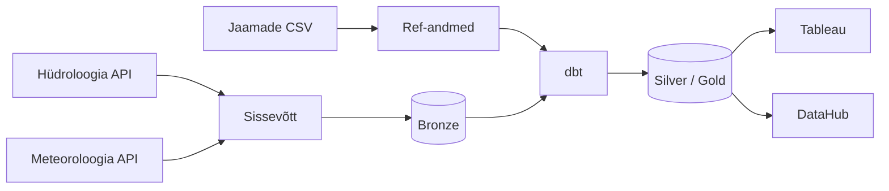

# Eesti jõgede hüdroloogilise seire andmetorustik

## Äriküsimus

Kuidas mõjutavad sademed ja õhutemperatuur veetaseme kõikumisi seirejaamades ning millised keskkonnategurid (õhutemperatuur, sademed) avaldavad veetaseme muutusele kõige tugevamat mõju?

**Mõõdikud:**

1. Veetase (cm) hüdromeetriajaamade kaupa — keskmine, miinimum, maksimum tunni kohta
2. Sademete hulk (mm) ja õhutemperatuur lähima meteoroloogijaama järgi

## Arhitektuur



Täpsem kirjeldus: [`docs/arhitektuur.md`](docs/arhitektuur.md)

## Andmestik

| Allikas | Tüüp | Ajas muutuv? | Roll |
|---------|------|--------------|------|
| Hüdroloogia API (`f_hydroseire`) | REST API (PostgREST) | Jah, tunnipõhine (~43h viivitus) | Veetase, temperatuur, äravool — 76 jaama |
| Meteoroloogia API (`f_kliima_tund`) | REST API (PostgREST) | Jah, iga päev (pakettöötlus ~05:01 EET) | Sademed, temperatuur, tuul, lumikate — 25 jaama |
| Hüdromeetria jaamad (`seeds/hydrometric_stations.csv`) | CSV / seed | Ei, staatiline | 76 jaama metaandmed koos kõrgusega MSL |
| Meteoroloogia jaamad (`seeds/meteorological_stations.csv`) | CSV / seed | Ei, staatiline | 25 jaama metaandmed |
| Seirejaamade vahekaugus | Automaatselt genereeritud (Haversine) | Ei (uuendatakse jaamade muutumise korral) | 3 lähimat meteojaam iga hüdrojaama kohta |

## Stack

| Komponent | Tööriist | Versioon |
|-----------|---------|---------|
| Orkestreerimine | Apache Airflow (TaskFlow API) | 3.2.1 |
| Transformatsioon | dbt Core | 1.9.x |
| Andmehoidla | PostgreSQL (pgduckdb laiendusega) | 16 |
| Näidikulaud | Tableau | — |
| Näidikulaud | Apache Superset | 6.0.1 |
| Andmekataloog | DataHub | head (latest) |
| Konteinerimine | Docker Compose | — |
| Keel | Python 3 | 3.x |
| Versioonikontroll | Git / GitHub | — |

## Käivitamine

```bash
# 1. Klooni repo ja liigu kausta
git clone https://github.com/SyncMaster7/deng-hydro-climate.git
cd deng-hydro-climate

# 2. Kopeeri keskkonnamuutujad
cp .env.example .env
# Muuda .env failis paroolid ja muud seaded vastavalt vajadusele

# 3. Käivita teenused
docker compose up -d --build

# 4. Käivita seed DAG (jaamade andmed ja läheduse arvutus)
# Airflow UI-s: käivita käsitsi seed_stations DAG
```

**Teenuste aadressid:**
- Airflow UI: http://localhost:8080
- Superset: http://localhost:8088
- DataHub: http://localhost:9002

## Saladused ja konfiguratsioon

Kõik saladused (paroolid, API võtmed, andmebaasi URL-id) on `.env` failis. Repos on ainult `.env.example`, mis näitab vajalike muutujate struktuuri ilma tegelike väärtusteta. Päris `.env` faili ei tohi GitHubi panna — see on `.gitignore`-s.

Vajalikud muutujad:

| Muutuja | Tähendus |
|---------|----------|
| `ANALYTICS_DB_USER` | Analüütikaandmebaasi kasutajanimi |
| `ANALYTICS_DB_PASSWORD` | Analüütikaandmebaasi parool |
| `ANALYTICS_DB_NAME` | Analüütikaandmebaasi nimi |
| `AIRFLOW_DB_USER` | Airflow metaandmebaasi kasutajanimi |
| `AIRFLOW_DB_PASSWORD` | Airflow metaandmebaasi parool |
| `AIRFLOW_DB_NAME` | Airflow metaandmebaasi nimi |
| `AIRFLOW_FERNET_KEY` | Airflow Fernet krüpteerimisvõti (ühenduste krüpteerimiseks) |
| `AIRFLOW_SECRET_KEY` | Airflow veebiserveri salajane võti |
| `AIRFLOW_JWT_SECRET` | Airflow JWT allkirjastamise võti |
| `AIRFLOW_ADMIN_USER` | Airflow admin kasutajanimi (loodakse esimesel käivitusel) |
| `AIRFLOW_ADMIN_PASSWORD` | Airflow admin parool |
| `AIRFLOW_ADMIN_EMAIL` | Airflow admin e-post |
| `AIRFLOW_UID` | Serveri kasutaja UID (vaikimisi 1000) |
| `SUPERSET_DB_USER` | Superset metaandmebaasi kasutajanimi |
| `SUPERSET_DB_PASSWORD` | Superset metaandmebaasi parool |
| `SUPERSET_DB_NAME` | Superset metaandmebaasi nimi |
| `SUPERSET_SECRET_KEY` | Superset veebiserveri salajane võti |
| `SUPERSET_ADMIN_USER` | Superset admin kasutajanimi |
| `SUPERSET_ADMIN_PASSWORD` | Superset admin parool |
| `SUPERSET_ADMIN_EMAIL` | Superset admin e-post |
| `DATAHUB_TOKEN_SERVICE_SIGNING_KEY` | DataHub tokeni allkirjastamise võti |
| `DATAHUB_TOKEN_SERVICE_SALT` | DataHub tokeni sool |

## Andmevoog lühidalt

1. **Toomine** — `fetch_hydro` ja `fetch_meteo` tõmbavad Keskkonnaagentuuri API-st tunnipõhised andmed (viivitus ~43h) ja salvestavad JSON-failidena `/data/raw/` alla
2. **Laadimine** — `ingest_hydro` ja `ingest_meteo` loevad JSON-failid, teevad UPSERT `bronze` skeemi (`bronze.hydro`, `bronze.meteo`)
3. **Transformatsioon** — `run_dbt` käivitab `dbt build`: `silver` kiht puhastab ja teisendab laiaks, `gold` kiht ühendab hüdro- ja meteoandmed lähima jaama järgi
4. **Testimine** — dbt kvaliteeditestid (väljatöötamisel)
5. **Näidikulaud** — Tableau ühendub otse andmebaasiga ja kuvab veetaseme ning ilmaandmete analüüsi

## Andmekvaliteedi testid

Projekt kontrollib järgmist:

1. Unikaalsusega piirang: `UNIQUE (jaam_kood, timeline_ts_utc, aegrida_nimi)` tabelis `bronze.hydro`
2. Unikaalsusega piirang: `UNIQUE (jaam_kood, aasta, kuu, paev, tund, element_kood)` tabelis `bronze.meteo`
3. Tühi vastus API-lt põhjustab `ValueError` — ülesanne ebaõnnestub ja logitakse `bronze.etl_log`
4. Iga pipeline'i jooks logitakse `bronze.etl_log` tabelisse koos kuupäeva, ridade arvu ja staatusega

Testide tulemused: `bronze.etl_log` tabelis — vaadatav Airflow UI kaudu või otse andmebaasist

## Projekti struktuur

```
.
├── README.md
├── docker-compose.yml
├── .env.example
├── .gitignore
├── docs/
│   └── arhitektuur.md
├── dags/
│   ├── hydro_meteo_pipeline.py   ← põhiline igapäevane pipeline
│   ├── seed_stations.py          ← jaamade seemneandmed ja läheduse arvutus
│   └── archive_raw_files.py      ← nädalane arhiveerimine
├── dbt_project/
│   ├── models/
│   │   ├── silver/               ← puhastatud kihid
│   │   └── gold/                 ← analüüsivalmis ühendatud andmed
│   ├── snapshots/                ← SCD2 jaamamuutuste jälgimiseks
│   └── profiles.yml
├── ingestion/
│   ├── haversine.py              ← kauguse arvutus
│   └── ...
├── seeds/
│   ├── hydrometric_stations.csv
│   └── meteorological_stations.csv
├── datahub/
│   ├── recipes/                  ← DataHub ingestion retseptid
│   └── artifacts/                ← dbt artefaktid DataHubi jaoks
└── docker/
    └── datahub-actions/          ← kohandatud DataHub Actions image
```

## Kokkuvõte, puudused ja võimalikud edasiarendused

**Kokkuvõte:**
- Täielik andmetorustik hüdro- ja meteoandmete igapäevaseks töötluseks on töökorras
- Backfill kaetud alates 2025-01-01 — ~7,8M rida hüdro ja ~2,9M rida meteo andmeid
- Superset dashboard on avaldatud kolme graafikuga
- DataHub andmekataloog toimib: PostgreSQL, dbt ja Superset ingestion lõpetatud

**Puudused:**
- DataHub Airflow ingestion on pooleli — plugin vajab paigaldamist Airflow konteineri sisse
- dbt kvaliteeditestid on välja töötamata

**Mis edasi:**
- DataHub Airflow ingestion lõpetamine (`acryl-datahub-airflow-plugin`)
- dbt kihtide kvaliteeditestide kirjutamine
- Pipeline'i tervise näidikulaud (`etl_log` + `airflow_db.task_instance` andmetest)
- FastAPI liidese arendamine — oma REST API andmete publitseerimiseks

## Meeskond

| Nimi | Pädevused | Panus projekti                                                                                                                                                 |
|------|-----------|----------------------------------------------------------------------------------------------------------------------------------------------------------------|
| Thea | Projektikoordineerimine, armatuurlaudade arendus, suhtlus huvigruppidega | Projektijuhtimine ja ajakava koordineerimine; analüütiliste armatuurlaudade ja visualiseerimislahenduste loomine ärikasutajatele Tableau keskkonnas            |
| Kermo | Tehniline infrastruktuur, backend-süsteemid, Python arendus | Infrastruktuuri ja backend-lahenduste ülesehitamine: serverid, Docker, Airflow orkestreerimine, Python automatiseerimine, dbt ja DataHub integratsioonid       |
| Aivo | Andmehaldus, andmejuhtimine, metaandmete haldus | Andmehalduse protsesside, metaandmete standardite ja andmekvaliteedi põhimõtete kujundamine; DataHub lahenduse kasutuselevõtt ja haldus                        |
| Kairi | Uurimisprojektid, metodoloogia, analüüs ja dokumentatsioon | Projekti struktuur, dokumentatsioon, metodoloogiline lähenemine ja nõuete analüüs; arendustegevuste vastavuse tagamine selgetele ja mõõdetavatele eesmärkidele |
| Anny | Ärianalüütik, rakenduse juht | DataHub platvormi haldus ja administreerimine; äriloogika, andmekirjelduste ja sõnastike koostamine ning DataHub sisu ajakohastamine                           |
