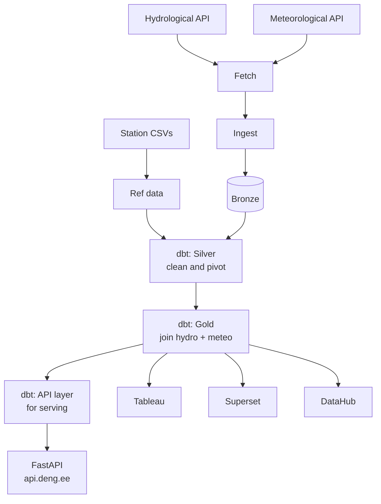

# Architecture — deng-hydro-climate

This document covers the full technical architecture of the deng-hydro-climate pipeline — data sources, data model, pipeline design, orchestration, transformation layers, and data quality testing.

For operational runbooks (how to restart, rebuild, or debug individual components) see [`docs/runbook/`](runbook/).

---

## Table of Contents

1. [Overview](#1-overview)
2. [Data Sources](#2-data-sources)
3. [Data Flow](#3-data-flow)
4. [Database Schemas and Data Model](#4-database-schemas-and-data-model)
5. [Orchestration — Airflow DAGs](#5-orchestration--airflow-dags)
6. [Transformation — dbt](#6-transformation--dbt)
7. [Public API — FastAPI](#7-public-api--fastapi)
8. [API Usage Monitoring](#8-api-usage-monitoring)
9. [Data Quality Tests](#9-data-quality-tests)
10. [EH2000 Elevation Correction](#10-eh2000-elevation-correction)
11. [Risks and Mitigations](#11-risks-and-mitigations)
12. [Privacy and Security](#12-privacy-and-security)

---

## 1. Overview

The pipeline ingests hourly hydrological and meteorological observations from the Estonian Environment Agency API, loads them into a PostgreSQL database, and transforms them through a layered dbt architecture (bronze → silver → gold → api). Transformed data is served via a public FastAPI endpoint and visualised in Apache Superset and Tableau dashboards. DataHub provides internal metadata cataloguing and lineage.

The daily pipeline runs at 06:00 UTC via Apache Airflow. All stages are logged to `bronze.etl_log`.



---

## 2. Data Sources

### APIs

| Source | Endpoint | Data | Stations | Granularity |
|---|---|---|---|---|
| Hydrological API | `keskkonnaandmed.envir.ee/f_hydroseire` | Water level, temperature, discharge | 76 hydrometric stations | Hourly |
| Meteorological API | `keskkonnaandmed.envir.ee/f_kliima_tund` | Precipitation, temperature, wind, humidity, sunshine | 25 meteorological stations | Hourly |

Both APIs are PostgREST interfaces published by the Estonian Environment Agency under CC BY 4.0. Data is available from 2012-01-01 onwards (hydro) and covers all of Estonia.

### Reference Data

| Source | File | Content |
|---|---|---|
| Hydrometric stations | `seeds/hydrometric_stations.csv` | 76 stations — coordinates, catchment, gauge zero elevation (EH2000) |
| Meteorological stations | `seeds/meteorological_stations.csv` | 25 stations — coordinates and altitude |
| Station proximity | Auto-generated by seed DAG | Top 3 nearest meteo stations per hydro station — 228 pairs (Haversine) |

### API Publish Lag

**Hydro (`f_hydroseire`):** ~43 hours behind real time. A complete local day has ~14,400–14,700 rows (76 stations × ~8 measurement types × 24 hours).

**Meteo (`f_kliima_tund`):** Published as a daily batch at ~05:01–05:03 EET (02:01–02:03 UTC). ~5,664 rows per day (25 stations × ~10 elements × 24 hours).

**Pipeline offset:** `API_LAG_DAYS = 3` — all fetch tasks use `data_interval_start.date() - timedelta(days=3)`, providing a 72-hour buffer that guarantees a complete day is always available regardless of lag variation.

### Available Meteo Endpoints (not all ingested)

| Endpoint | Granularity | Status |
|---|---|---|
| `f_kliima_tund` | Hourly | **Active — used in pipeline** |
| `f_kliima_paev` | Daily aggregates | Available, not ingested |
| `f_kliima_minut` | 10-minute | Available, not ingested |
| `f_kliima_kuu` | Monthly | Available, not ingested |

### API Field Names

**Hydro (`f_hydroseire`):**
`jaam_kood, jaam_nimi, valgala_nimi, valgala_suurus_km2, kaugus_suudmest_km, jaam_laiuskraad, jaam_pikkuskraad, jaam_taisnimi, veekogu_nimi, timeline_ts_utc, timeline_ts_local, aegrida_nimi, vaartus`

**Meteo (`f_kliima_tund`):**
`jaam_kood, jaam_nimi, aasta, kuu, paev, tund, vaartus, element_kood, element_nimi_eng, element_yhik_eng, avaandmed_ts`

> Critical: hydro bronze uses `aegrida_nimi` (not `aegrida_kood`); meteo bronze uses `tund` (not `kellaaeg`).

### Measurement Types

**Hydro (`aegrida_nimi`):** WL avg, WL min, WL max, WT avg, WT min, WT max, Äravool avg, Äravool min, Äravool max

**Meteo (`element_kood`):** PR1H, TA, TAN1H, TAX1H, RH, PA0, WS10M, WSX1H, WD10M, SDUR1H

---

## 3. Data Flow

```
fetch_hydro ──┐
              ├──► ingest_hydro ──► bronze.hydro ──┐
fetch_meteo ──┘                                    ├──► dbt build ──► silver ──► gold ──► api
              └──► ingest_meteo ──► bronze.meteo ──┘
```

1. **Fetch** — `fetch_hydro` and `fetch_meteo` call the Environment Agency API and save raw JSON responses to `/data/raw/hydro/` and `/data/raw/meteo/`
2. **Ingest** — `ingest_hydro` and `ingest_meteo` read the JSON files and batch-UPSERT into the bronze schema
3. **Transform** — `run_dbt` runs `dbt build`: silver pivots raw rows wide, gold joins hydro to the nearest meteo station, api unpivots back to long format for the public API serving layer
4. **Test** — 26 data quality tests run automatically as part of `dbt build`; failures halt downstream model builds
5. **Serve** — FastAPI reads from the api schema; Tableau and Superset connect directly to the gold schema

All stages log to `bronze.etl_log` with row counts (`rows_processed`, `rows_loaded`) and status.

---

## 4. Database Schemas and Data Model

The analytics database (`hydro_climate_db`) is organised into six schemas:

| Schema | Role |
|---|---|
| `ref` | Station reference data — loaded from CSV seeds, auto-generated proximity, SCD2 snapshots |
| `bronze` | Raw API responses — exact field names, no transformation, UPSERT with unique constraints |
| `silver` | Cleaned and pivoted — one wide row per station per hour, EH2000 correction applied |
| `gold` | Analysis-ready — hydro joined to nearest meteo station, Estonian local time |
| `api` | FastAPI serving layer — fact/dim design, long format, incremental |
| `monitoring` | API request log — one row per FastAPI request |

### ref schema

**`ref.hydrometric_stations`**
76 hydrometric stations. Fields: `id, station_code (INTEGER UNIQUE), station_category, station_name, station_fullname, water_body, catchment_name, catchment_size_km2, distance_from_mouth_km, station_altitude_msl_m, latitude, longitude, is_active, loaded_at`

**`ref.meteorological_stations`**
25 meteorological stations. Fields: `id, station_code (TEXT UNIQUE), station_category, station_name, latitude, longitude, altitude_m, is_active, loaded_at`

**`ref.station_proximity`**
228 hydro-meteo station pairs. Auto-generated by seed DAG using Haversine distance. Fields: `id, hydro_station_code, meteo_station_code, distance_km, proximity_rank (1–3), loaded_at`
UNIQUE: `(hydro_station_code, proximity_rank)`

### bronze schema

**`bronze.hydro`**
Raw API response from `f_hydroseire`. One row per station per measurement type per hour.
Fields: `jaam_kood, jaam_nimi, jaam_taisnimi, valgala_nimi, valgala_suurus_km2, kaugus_suudmest_km, jaam_laiuskraad, jaam_pikkuskraad, veekogu_nimi, timeline_ts_utc, timeline_ts_local, aegrida_nimi, vaartus, loaded_at`
UNIQUE: `(jaam_kood, timeline_ts_utc, aegrida_nimi)`

**`bronze.meteo`**
Raw API response from `f_kliima_tund`. One row per station per element per hour.
Fields: `jaam_kood, jaam_nimi, aasta, kuu, paev, tund, vaartus, element_kood, element_nimi_eng, element_yhik_eng, avaandmed_ts, loaded_at`
UNIQUE: `(jaam_kood, aasta, kuu, paev, tund, element_kood)`

**`bronze.etl_log`**
Pipeline run log. One row per task per run. Fields include `target_date`, `rows_processed` (input rows), `rows_loaded` (inserted rows), status. Primary diagnostic tool — check this before touching the Airflow UI.

### silver schema

**`silver.hydro`**
Pivoted wide from `bronze.hydro`. One row per station per hour.
Key columns: `hydro_station_code, jaam_nimi, jaam_taisnimi, latitude, longitude, timeline_ts_utc, wl_avg, wl_min, wl_max, wl_avg_eh2000, wt_avg, wt_min, wt_max, discharge_avg, discharge_min, discharge_max, station_category, station_altitude_msl_m`

`wl_avg_eh2000` is the absolute water surface elevation in metres above EH2000 — see [Section 10](#10-eh2000-elevation-correction) for full details.

**`silver.meteo`**
Pivoted wide from `bronze.meteo`. One row per station per hour.
Key columns: `jaam_kood, jaam_nimi, observation_ts (UTC), precipitation_mm, temp_avg, temp_min, temp_max, humidity_pct, pressure_hpa, wind_speed_ms, wind_gust_ms, wind_direction_deg, sunshine_duration_min`

> `silver.meteo` constructs `observation_ts` using `make_timestamptz` with `Europe/Tallinn` — the raw `aasta/kuu/paev/tund` fields are local Estonian time, not UTC.

### gold schema

**`gold.hydro_meteo`**
Hydro joined to nearest meteo station (`proximity_rank=1`). One row per hydro station per hour.
Key columns: all `silver.hydro` columns + `observation_ts_local` (Estonian local time), `meteo_station_code, meteo_station_name, meteo_distance_km, precipitation_mm, air_temp_avg, air_temp_min, air_temp_max, humidity_pct, pressure_hpa, wind_speed_ms, wind_gust_ms, wind_direction_deg, sunshine_duration_min`

> Always use `observation_ts_local` for visualisation and analysis — not `timeline_ts_utc`. Timestamp alignment verified correct (spot-checked station 41061, 2026-05-01).

### api schema

Dedicated dbt serving layer for the public FastAPI. Fact/dim design, separate from gold.

| Table | Type | Description |
|---|---|---|
| `api.stations_hydro` | Dimension (table) | All 76 hydrometric stations |
| `api.stations_meteo` | Dimension (table) | All 25 meteorological stations |
| `api.measurement_types` | Dimension (table) | All 19 element codes with description, unit, source |
| `api.observations_hydro` | Fact (incremental) | Hydro measurements in long format — one row per station per timestamp per element |
| `api.observations_meteo` | Fact (incremental) | Meteo measurements in long format — one row per station per timestamp per element |

`api.observations_hydro` element codes (lowercase): `wl_avg, wl_min, wl_max, wt_avg, wt_min, wt_max, q_avg, q_min, q_max`
`api.observations_meteo` element codes (lowercase): `pr1h, ta, tan1h, tax1h, rh, pa0, ws10m, wsx1h, wd10m, sdur1h`

Both observation tables have a composite index on `(station_code, element_code, obs_ts)` for efficient filtering. `published_at` is captured at dbt run time (06:00 UTC daily) and represents when data became available on the API, not ingestion time.

### monitoring schema

**`monitoring.request_log`**
One row per FastAPI request. Written by middleware after every response.
Fields: `id (BIGSERIAL), requested_at (TIMESTAMPTZ), method, endpoint, query_params (JSONB), status_code, response_ms (NUMERIC 10,2), client_ip`
Indexes on `requested_at DESC`, `endpoint`, `status_code`.

---

## 5. Orchestration — Airflow DAGs

### `hydro_meteo_pipeline` — daily at 06:00 UTC

The main production pipeline.

```
fetch_hydro ──► ingest_hydro ──┐
                                ├──► run_dbt
fetch_meteo ──► ingest_meteo ──┘
```

| Task | What it does |
|---|---|
| `fetch_hydro` | Calls `f_hydroseire` API, filters by `timeline_ts_local` (not UTC — timezone-safe), saves `/data/raw/hydro/hydro_{date}.json`. Raises `ValueError` if response is empty. |
| `fetch_meteo` | Calls `f_kliima_tund` API, saves `/data/raw/meteo/meteo_{date}.json`. Same empty-response guard. |
| `ingest_hydro` | Reads JSON, batch-UPSERTs into `bronze.hydro` via `execute_values()`. |
| `ingest_meteo` | Reads JSON, deduplicates by unique key (keeps latest `avaandmed_ts`), batch-UPSERTs into `bronze.meteo`. |
| `run_dbt` | Runs `dbt build` — transforms all layers and runs all 26 data quality tests. |

All tasks use `data_interval_start.date() - timedelta(days=API_LAG_DAYS)` where `API_LAG_DAYS = 3`.
Fetch tasks have retry config: `retries=3`, base 15 min, exponential backoff (~1h30m total window).
`fetch_hydro` builds the query string manually (not via `params=`) to avoid `requests` URL-encoding colons as `%3A`, which caused 404 errors.

### `seed_stations` — manual trigger only

Loads station reference data and recalculates proximity pairs.

| Task | What it does |
|---|---|
| `load_hydrometric_stations` | UPSERTs from `hydrometric_stations.csv`, returns changed row count |
| `load_meteorological_stations` | UPSERTs from `meteorological_stations.csv`, returns changed row count |
| `calculate_proximity` | Runs Haversine calculation (conditional on changed count or empty table), writes 228 pairs to `ref.station_proximity` |
| `run_snapshot` | Runs `dbt snapshot` for both station tables — creates SCD2 history |

### `archive_raw_files` — weekly, Sunday at 00:00 UTC

Compresses raw JSON files older than 7 days into `.json.gz`, organised by `year/month` folders under `/data/archive/`, and deletes the originals.

---

## 6. Transformation — dbt

### Project Structure

```
dbt_project/
├── dbt_project.yml
├── packages.yml              ← dbt-utils (composite unique tests)
├── profiles.yml
├── macros/
│   └── generate_schema_name.sql   ← returns custom_schema_name as-is
├── models/
│   ├── sources/
│   │   └── sources.yml            ← source definitions + generic tests
│   ├── silver/
│   │   ├── hydro.sql              ← pivot + EH2000 correction
│   │   └── meteo.sql              ← pivot + timestamp construction
│   ├── gold/
│   │   └── hydro_meteo.sql        ← join hydro + meteo on proximity_rank=1
│   └── api/                       ← 5 models for FastAPI serving layer
├── snapshots/
│   ├── snap_hydro_stations.sql    ← SCD2 snapshot of hydrometric_stations
│   └── snap_meteo_stations.sql    ← SCD2 snapshot of meteorological_stations
└── tests/                         ← 10 singular SQL test files
```

### Key Design Decisions

- `generate_schema_name.sql` macro returns `custom_schema_name` as-is — models land in their own schemas (`bronze`, `silver`, `gold`, `api`) without the default dbt project prefix
- `silver/hydro.sql` joins `snap_hydro_stations` (dbt snapshot) for point-in-time EH2000 correction, with a COALESCE fallback to `ref.hydrometric_stations` for data predating the first snapshot run (2026-05-09)
- `ref.hydrometric_stations` and `ref.meteorological_stations` are dbt **sources** (not refs) — defined in `sources/sources.yml`, loaded by the Airflow seed DAG
- api schema models use `source('ref', 'hydrometric_stations')` — NOT `ref('hydrometric_stations')`
- All dbt commands require `--log-path /tmp` and `--target-path /tmp/dbt_target` — the mounted `dbt_project/` directory is read-only from the Airflow container

---

## 7. Public API — FastAPI

FastAPI service running in `deng-fastapi`, publicly accessible at `https://api.deng.ee`. Full interactive documentation at `https://api.deng.ee/docs`.

### Endpoints

| Method | Endpoint | Description |
|---|---|---|
| GET | `/v1/stations/hydro` | All 76 hydrometric stations |
| GET | `/v1/stations/hydro/{station_code}` | Single hydro station |
| GET | `/v1/stations/meteo` | All 25 meteorological stations |
| GET | `/v1/stations/meteo/{station_code}` | Single meteo station |
| GET | `/v1/elements` | All element codes (`?source=hydro` or `meteo`) |
| GET | `/v1/observations/hydro` | Hydro observations |
| GET | `/v1/observations/hydro/latest` | Latest observation per station per element |
| GET | `/v1/observations/meteo` | Meteo observations |
| GET | `/health` | Health check |

### Observation Query Parameters

| Parameter | Type | Description |
|---|---|---|
| `station_code` | comma-separated integers | e.g. `41061,26227` |
| `element_code` | comma-separated strings | e.g. `wl_avg,wl_min` |
| `from_ts` | ISO 8601 datetime | Start of observation window |
| `to_ts` | ISO 8601 datetime | End of observation window |
| `limit` | integer 1–50000 | Default 10000 |

> The default query window is last 24 hours. Due to `API_LAG_DAYS=3`, freshest data is ~3 days old — consumers should always pass explicit `from_ts`/`to_ts` or use the `/latest` endpoint.

### Technical Details

- Rate limited to 60 requests/minute per IP via `slowapi`
- asyncpg connection pool: min 2, max 10 connections to `analytics-db`
- Reverse proxied via Caddy — `api.deng.ee` block in `/etc/caddy/Caddyfile` (not in Git)
- All element codes are lowercase in the api schema: `wl_avg` not `WL_AVG`

For operational details (restart, rebuild) see [`docs/runbook/fastapi_runbook.md`](runbook/fastapi_runbook.md).

---

## 8. API Usage Monitoring

Every public API request is logged to `monitoring.request_log` by a FastAPI middleware. Browser noise (favicon, touch icons, OpenAPI spec) is excluded.

Useful queries:

```sql
-- Recent requests
SELECT * FROM monitoring.request_log ORDER BY requested_at DESC LIMIT 20;

-- Request counts by endpoint
SELECT endpoint, count(*) FROM monitoring.request_log GROUP BY endpoint ORDER BY count DESC;

-- Average response time by endpoint
SELECT endpoint, round(avg(response_ms), 2) AS avg_ms FROM monitoring.request_log GROUP BY endpoint ORDER BY avg_ms DESC;

-- Error rate by status code
SELECT status_code, count(*) FROM monitoring.request_log GROUP BY status_code ORDER BY status_code;
```

---

## 9. Data Quality Tests

dbt runs 26 automated tests on every `dbt build`. All tests target the bronze layer. A test failure (severity: `error`) halts all downstream model builds — bad data cannot propagate to silver, gold, or api layers.

Tests cover six data quality dimensions: Completeness, Correctness, Format & Validity, Uniqueness, Integrity, and Timeliness.

### Generic Tests (16) — defined in `models/sources/sources.yml`

| Table | Test | Columns | Dimension |
|---|---|---|---|
| `bronze.hydro` | `not_null` | `jaam_kood, timeline_ts_utc, timeline_ts_local, aegrida_nimi, loaded_at` | Completeness |
| `bronze.hydro` | `accepted_values` | `aegrida_nimi` — 9 known measurement types | Correctness |
| `bronze.hydro` | `unique_combination_of_columns` | `(jaam_kood, timeline_ts_utc, aegrida_nimi)` | Uniqueness |
| `bronze.meteo` | `not_null` | `jaam_kood, aasta, kuu, paev, tund, element_kood, loaded_at` | Completeness |
| `bronze.meteo` | `accepted_values` | `element_kood` — 10 known element codes | Correctness |
| `bronze.meteo` | `unique_combination_of_columns` | `(jaam_kood, aasta, kuu, paev, tund, element_kood)` | Uniqueness |

### Singular Tests (10) — defined in `tests/`

| Test file | Check | Dimension |
|---|---|---|
| `bronze_hydro_wl_range.sql` | Water level: −100 to 1500 cm | Correctness |
| `bronze_hydro_wt_range.sql` | Water temperature: −5 to 35°C | Correctness |
| `bronze_hydro_discharge_range.sql` | Discharge: −300 to 15,000 m³/s | Correctness |
| `bronze_hydro_no_future_timestamps.sql` | `timeline_ts_utc` not in the future | Correctness |
| `bronze_meteo_temperature_range.sql` | Air temperature (TA, TAN1H, TAX1H): −40 to 35°C | Correctness |
| `bronze_meteo_precipitation_non_negative.sql` | Precipitation (PR1H) ≥ 0 mm | Correctness |
| `bronze_meteo_humidity_range.sql` | Relative humidity (RH): 0–100% | Correctness |
| `bronze_meteo_pressure_range.sql` | Air pressure (PA0): 950–1060 hPa | Correctness |
| `bronze_meteo_wind_speed_non_negative.sql` | Wind speed (WS10M, WSX1H) ≥ 0 m/s | Correctness |
| `bronze_meteo_tund_range.sql` | Hour of day: 0–23 | Format & Validity |

> `SDUR1H` (sunshine duration) is deliberately excluded from singular tests. Negative values are a known sensor calibration artefact in the source data and are preserved in bronze by design.

Run tests manually:

```bash
docker exec -it deng-dbt dbt test \
  --select source:bronze \
  --project-dir /dbt \
  --profiles-dir /dbt \
  --log-path /tmp/dbt_logs \
  --target-path /tmp/dbt_target
```

### Current Coverage

- Bronze layer: 26 tests — all passing
- Silver, gold, api layers: not yet tested

---

## 10. EH2000 Elevation Correction

### What EH2000 is

EH2000 (Eesti kõrgussüsteem 2000) is the Estonian national height datum. All hydrometric station gauge zeros are recorded in `station_altitude_msl_m` as metres above EH2000.

### `wl_avg_eh2000` — Absolute Water Surface Elevation

`wl_avg_eh2000` represents the absolute water surface elevation in metres above EH2000.

**Formula:** `wl_avg_eh2000 = (wl_avg / 100.0) + station_altitude_msl_m`

- `wl_avg` — raw gauge reading in **cm** above the station's local gauge zero
- `station_altitude_msl_m` — gauge zero elevation in **metres above EH2000**
- Result — absolute water surface elevation in **metres above EH2000**
- If `station_altitude_msl_m` is NULL, result is NULL (not a fallback to `wl_avg`)

Applies to all 76 stations — all have `station_altitude_msl_m` populated as gauge zero in EH2000.

**Verification:**
- Vasknarva (2026-04-25 04:00 UTC): `wl_avg=82.0cm`, `station_altitude_msl_m=29.18m` → `wl_avg_eh2000=30.00m` ✓ matches ilmateenistus ~30.02m
- Vihterpalu: `station_altitude_msl_m=5.56m` confirmed from ilmateenistus station page ✓
- Narva linn: `station_altitude_msl_m=-0.90m` confirmed ✓
- Praaga: `station_altitude_msl_m=28.16m` confirmed ✓

### When to Use Which Column

| Column | Use for |
|---|---|
| `wl_avg` (raw cm) | All analysis charts — precipitation vs water level, temperature comparisons, time series. Shows relative change — what matters for hydrology. |
| `wl_avg_eh2000` (metres, EH2000) | Cross-station elevation comparisons, absolute water surface height, navigation safety context. |

### SCD2 Snapshot for Point-in-Time Accuracy

`silver/hydro.sql` joins `snap_hydro_stations` (dbt SCD2 snapshot) to apply the EH2000 correction using the gauge zero value that was valid at the time of each observation:

```sql
timeline_ts_utc >= dbt_valid_from::timestamptz
AND timeline_ts_utc < dbt_valid_to::timestamptz
```

A COALESCE fallback to `ref.hydrometric_stations` covers data older than 2026-05-09 (before snapshots existed).

---

## 11. Risks and Mitigations

| Risk | Impact | Mitigation |
|---|---|---|
| API returns empty response | Pipeline fails, day not loaded | `ValueError` guard on empty response; `retries=3` with exponential backoff (~1h30m window); `catchup=True` fills gaps automatically |
| API publish lag increases | Partial days ingested | `API_LAG_DAYS=3` (72h buffer) guarantees a complete day; `etl_log` records row counts every run |
| Station metadata changes (gauge zero, category) | Incorrect EH2000 correction on historical data | dbt SCD2 snapshot preserves change history; COALESCE fallback to live ref table |
| Upstream API data gaps | Missing data — not a pipeline error | Documented — October 2025 anomalies in `bronze.meteo`; pipeline is correct, problem is at source |
| Bronze layer data quality anomaly | Bad data propagates to silver/gold/api | dbt tests with `error` severity halt downstream builds; `run_dbt` Airflow task fails and logs to `bronze.etl_log` |

---

## 12. Privacy and Security

This project contains no personal data. All data is publicly available environmental monitoring measurements (rivers, weather) from the Estonian Environment Agency API.

Security measures:
- All passwords and keys are stored in `.env`, listed in `.gitignore`, never committed
- Only `.env.example` is tracked in Git — shows required variable structure without real values
- Database authentication: `POSTGRES_HOST_AUTH_METHOD=md5` for both PostgreSQL services
- DataHub admin password changed from default at bootstrap

---

*deng-hydro-climate — architecture.md — last updated 2026-05-29*
