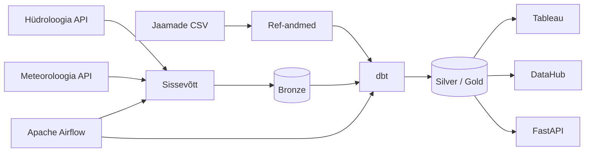

# Arhitektuur

## Äriküsimus

Kuidas mõjutavad sademed ja õhutemperatuur veetaseme kõikumisi seirejaamades ning millised keskkonnategurid (õhutemperatuur, sademed) avaldavad veetaseme muutusele kõige tugevamat mõju?

## Mõõdikud

1. **Veetase (cm)** hüdromeetriajaamade kaupa — keskmine, miinimum, maksimum tunni kohta; kasutatakse EH2000 kõrgusparandusega korrigeeritud väärtust.
2. **Sademete hulk (mm)** — lähima meteoroloogiajaama tunnipõhine mõõtmine; lähedus arvutatud Haversine'i valemiga.

## Andmeallikad

| Allikas | Tüüp | Ajas muutuv? | Roll                                                          |
|---------|------|--------------|---------------------------------------------------------------|
| Hüdroloogia API `f_hydroseire` (keskkonnaandmed.envir.ee) | REST API (PostgREST) | Jah, tunnipõhine (~43h viivitus) | Veetase, veetemperatuur, äravool — 76 hüdromeetriajaama       |
| Meteoroloogia API `f_kliima_tund` (keskkonnaandmed.envir.ee) | REST API (PostgREST) | Jah, iga päev pakettöötlusena ~05:01 EET | Sademed, temperatuur, tuul, niiskus, päikesepaiste — 25 jaama |
| Hüdromeetriajaamad (`seeds/hydrometric_stations.csv`) | CSV / seed | Ei, staatiline | 76 jaama metaandmed sh kõrgus MSL, jõgikond, koordinaadid     |
| Meteoroloogiajaamad (`seeds/meteorological_stations.csv`) | CSV / seed | Ei, staatiline | 25 jaama metaandmed sh koordinaadid ja kõrgus                 |
| Seirejaamade vahekaugus | Automaatselt genereeritud Seed DAG-is (Haversine) | Ei (uuendatakse muutuste korral) | Top 3 lähimat meteojaam iga 76 hüdrojaama kohta — 228 paari   |

## Andmevoog

> Igapäevane pipeline käivitatakse automaatselt kell 06:00 UTC. Andmete toomine, laadimine ja dbt transformatsioon toimuvad järjestikku. Kõik etapid logitakse `bronze.etl_log` tabelisse.

## Andmebaasi kihid

| Kiht | Roll |
|------|------|
| `ref` | Jaamade viiteandmed — laetud CSV seedidest. Sisaldab seirejaamade vahekauguse tabeli (automaatne Haversine arvutus) ja SCD2 snapshot'id jaamamuutuste jälgimiseks. |
| `bronze` | API toorvastus — täpselt nii nagu API tagastas, ilma transformatsioonita. UPSERT unikaalsuspiiranguga. Sisaldab ka `etl_log` pipeline'i logitabelit. |
| `silver` | dbt mudelid — puhastatud, pivoteeritud laiade ridadena (üks rida jaama ja tunni kohta). EH2000 kõrgusparandus rakendatud hüdroandmetele. |
| `gold` | dbt mudelid — hüdro ühendatud lähima meteojaamaga (proximity_rank=1). Analüüsivalmis, Eesti kohaliku ajaga (`observation_ts_local`). |

### Peamised tabelid

| Tabel | Kirjeldus |
|-------|-----------|
| `ref.hydrometric_stations` | 76 hüdrojaam koos koordinaatide, jõgikonna, kõrgusega MSL |
| `ref.meteorological_stations` | 25 meteojaam koos koordinaatide ja kõrgusega |
| `ref.station_proximity` | 228 paari — top 3 lähimat meteojaam iga hüdrojaama kohta (Haversine) |
| `bronze.hydro` | API toorvastus — 1 rida jaama, tunni ja mõõtmetüübi kohta. Unikaalne: `(jaam_kood, timeline_ts_utc, aegrida_nimi)` |
| `bronze.meteo` | API toorvastus — 1 rida jaama, tunni ja elemendi kohta. Unikaalne: `(jaam_kood, aasta, kuu, paev, tund, element_kood)` |
| `bronze.etl_log` | Pipeline'i logi — iga tase logib alguse, lõpu, ridade arvu (`rows_processed`, `rows_loaded`) ja staatuse |
| `silver.hydro` | Pivot laiaks — `wl_avg`, `wl_min`, `wl_max`, `wl_avg_eh2000` (EH2000 absoluutkõrgus meetrites), `wt_avg`, `discharge_avg` jm |
| `silver.meteo` | Pivot laiaks — `precipitation_mm`, `temp_avg`, `wind_speed_ms`, `sunshine_duration_min` jm |
| `gold.hydro_meteo` | Hüdro + meteo ühendatult, `observation_ts_local` Eesti ajas, analüüsi jaoks |

## Orkestreerimine

Kolm Apache Airflow DAGi:

| DAG | Ajakava | Ülesanne |
|-----|---------|----------|
| `hydro_meteo_pipeline` | Iga päev kell 06:00 UTC | fetch_hydro → fetch_meteo → ingest_hydro → ingest_meteo → run_dbt |
| `seed_stations` | Käsitsi | Jaamade CSV laadimine, seirejaamade vahekauguse arvutus, dbt snapshot |
| `archive_raw_files` | Iganädalaselt (pühapäev 00:00 UTC) | JSON failid >7 päeva vanused kompresseeritakse .gz formaati ja arhiveeritakse |

> API viivitus: ~43 tundi — kõik ülesanded kasutavad `API_LAG_DAYS = 3` (72h puhver, garanteerib alati täieliku päeva).

## Tööjaotus

| Nimi | Pädevused | Panus projekti                                                                                                                                                 |
|------|-----------|----------------------------------------------------------------------------------------------------------------------------------------------------------------|
| Thea | Projektikoordineerimine, armatuurlaudade arendus, suhtlus huvigruppidega | Projektijuhtimine ja ajakava koordineerimine; analüütiliste armatuurlaudade ja visualiseerimislahenduste loomine ärikasutajatele Tableau keskkonnas               |
| Kairi | Uurimisprojektid, metodoloogia, analüüs ja dokumentatsioon | Projekti struktuur, dokumentatsioon, metodoloogiline lähenemine ja nõuete analüüs; arendustegevuste vastavuse tagamine selgetele ja mõõdetavatele eesmärkidele |
| Anny | Ärianalüütik, rakenduse juht | DataHub platvormi haldus ja administreerimine; äriloogika, andmekirjelduste ja sõnastike koostamine ning DataHub sisu ajakohastamine                           |
| Aivo | Andmehaldus, andmejuhtimine, metaandmete haldus | Andmehalduse protsesside, metaandmete standardite ja andmekvaliteedi põhimõtete kujundamine; DataHub lahenduse kasutuselevõtt ja haldus                        |
| Kermo | Tehniline infrastruktuur, backend-süsteemid, Python arendus | Infrastruktuuri ja backend-lahenduste ülesehitamine: serverid, Docker, Airflow orkestreerimine, Python automatiseerimine, dbt ja DataHub integratsioonid       |

## Riskid

| Risk                                              | Mõju | Maandus |
|---------------------------------------------------|------|---------|
| API ei vasta või tagastab tühja vastuse           | Pipeline ebaõnnestub, päev jääb laadimata | `ValueError` tühja vastuse korral; `retries=3` eksponentsiaalse taandumisega (~1h30m aken); `catchup=True` täidab lüngad automaatselt |
| API andmete viivitus suureneb                     | Osalised päevad laaditakse, andmed ebatäielikud | `API_LAG_DAYS=3` (72h puhver) tagab alati täieliku päeva; `etl_log` logib ridade arvu igal jooksul |
| Seirejaama andmete muutumine (kõrgus, kategooria) | Vale EH2000 parandus ajaloolistele andmetele | dbt SCD2 snapshot (`snap_hydro_stations`) salvestab muutuste ajaloo; COALESCE tagavaravariandiga `ref.hydrometric_stations` vastu |
| Upstream API andmelüngad                          | Andmed puuduvad allikast, ei ole pipeline'i viga | Dokumenteeritud — oktoober 2025 anomaaliad bronze.meteo-s; pipeline on korrektne, probleem on allikas |

## Privaatsus ja turve

Projekt ei sisalda isikuandmeid. Kõik andmed on avalikud keskkonnaseire mõõtmised (jõed, ilm) Keskkonnaagentuuri API-st.

Turvameetmed:
- Kõik paroolid ja võtmed on `.env` failis, mida ei tohi GitHubi panna (`.gitignore`-s)
- Repos on ainult `.env.example` struktuurifail ilma tegelike väärtusteta
- Andmebaasi autentimine: `POSTGRES_HOST_AUTH_METHOD=md5` mõlema PostgreSQL teenuse jaoks
- DataHub admin parool muudetud vaikimisi paroolist
