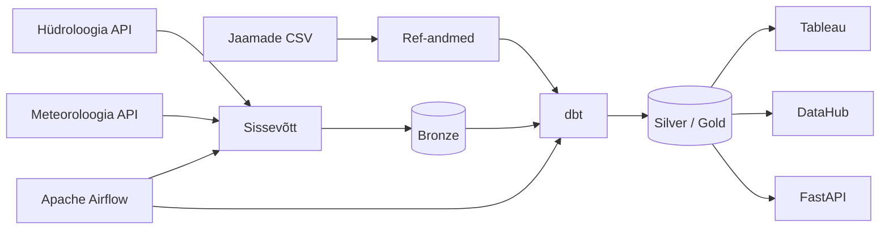

# Arhitektuur

## Äriküsimus

Kuidas mõjutavad sademed ja õhutemperatuur veetaseme kõikumisi seirejaamades ning millised keskkonnategurid (õhutemperatuur, sademed) avaldavad veetaseme muutusele kõige tugevamat mõju?

## Mõõdikud

1. **Veetase (cm)** hüdromeetriajaamade kaupa — keskmine, miinimum, maksimum tunni kohta; kasutatakse EH2000 kõrgusparandusega korrigeeritud väärtust.
2. **Sademete hulk (mm)** — lähima meteoroloogiajaama tunnipõhine mõõtmine; lähedus arvutatud Haversine'i valemiga.

## Andmeallikad

| Allikas | Tüüp | Ajas muutuv? | Roll |
|---------|------|--------------|------|
| Hüdroloogia API `f_hydroseire` (keskkonnaandmed.envir.ee) | REST API (PostgREST) | Jah, tunnipõhine (~43h viivitus) | Veetase, veetemperatuur, äravool — 76 hüdromeetriajaama |
| Meteoroloogia API `f_kliima_tund` (keskkonnaandmed.envir.ee) | REST API (PostgREST) | Jah, iga päev pakettöötlusena ~05:01 EET | Sademed, temperatuur, tuul, niiskus, päikesepaiste — 25 jaama |
| Hüdromeetriajaamad (`seeds/hydrometric_stations.csv`) | CSV / seed | Ei, staatiline | 76 jaama metaandmed sh kõrgus MSL, jõgikond, koordinaadid |
| Meteoroloogiajaamad (`seeds/meteorological_stations.csv`) | CSV / seed | Ei, staatiline | 25 jaama metaandmed sh koordinaadid ja kõrgus |
| Seirejaamade vahekaugus | Automaatselt genereeritud Seed DAG-is (Haversine) | Ei (uuendatakse muutuste korral) | Top 3 lähimat meteojaam iga 76 hüdrojaama kohta — 228 paari |

## Andmevoog

> Igapäevane pipeline käivitatakse automaatselt kell 06:00 UTC. Andmete toomine, laadimine ja dbt transformatsioon toimuvad järjestikku. Kõik etapid logitakse `bronze.etl_log` tabelisse.

## Andmebaasi kihid

| Kiht | Roll |
|------|------|
| `ref` | Jaamade viiteandmed — laetud CSV seedidest. Sisaldab seirejaamade vahekauguse tabeli (automaatne Haversine arvutus) ja SCD2 snapshot'id jaamamuutuste jälgimiseks. |
| `bronze` | API toorvastus — täpselt nii nagu API tagastas, ilma transformatsioonita. UPSERT unikaalsuspiiranguga. Sisaldab ka `etl_log` pipeline'i logitabelit. |
| `silver` | dbt mudelid — puhastatud, pivoteeritud laiade ridadena (üks rida jaama ja tunni kohta). EH2000 kõrgusparandus rakendatud hüdroandmetele. |
| `gold` | dbt mudelid — hüdro ühendatud lähima meteojaamaga (proximity_rank=1). Analüüsivalmis, Eesti kohaliku ajaga (`observation_ts_local`). |

### Peamised tabelid

| Tabel | Kirjeldus |
|-------|-----------|
| `ref.hydrometric_stations` | 76 hüdrojaam koos koordinaatide, jõgikonna, kõrgusega MSL |
| `ref.meteorological_stations` | 25 meteojaam koos koordinaatide ja kõrgusega |
| `ref.station_proximity` | 228 paari — top 3 lähimat meteojaam iga hüdrojaama kohta (Haversine) |
| `bronze.hydro` | API toorvastus — 1 rida jaama, tunni ja mõõtmetüübi kohta. Unikaalne: `(jaam_kood, timeline_ts_utc, aegrida_nimi)` |
| `bronze.meteo` | API toorvastus — 1 rida jaama, tunni ja elemendi kohta. Unikaalne: `(jaam_kood, aasta, kuu, paev, tund, element_kood)` |
| `bronze.etl_log` | Pipeline'i logi — iga tase logib alguse, lõpu, ridade arvu (`rows_processed`, `rows_loaded`) ja staatuse |
| `silver.hydro` | Pivot laiaks — `wl_avg`, `wl_min`, `wl_max`, `wl_avg_eh2000` (EH2000 absoluutkõrgus meetrites), `wt_avg`, `discharge_avg` jm |
| `silver.meteo` | Pivot laiaks — `precipitation_mm`, `temp_avg`, `wind_speed_ms`, `sunshine_duration_min` jm |
| `gold.hydro_meteo` | Hüdro + meteo ühendatult, `observation_ts_local` Eesti ajas, analüüsi jaoks |

## Orkestreerimine

Kolm Apache Airflow DAGi:

| DAG | Ajakava | Ülesanne |
|-----|---------|----------|
| `hydro_meteo_pipeline` | Iga päev kell 06:00 UTC | fetch_hydro → fetch_meteo → ingest_hydro → ingest_meteo → run_dbt |
| `seed_stations` | Käsitsi | Jaamade CSV laadimine, seirejaamade vahekauguse arvutus, dbt snapshot |
| `archive_raw_files` | Iganädalaselt (pühapäev 00:00 UTC) | JSON failid >7 päeva vanused kompresseeritakse .gz formaati ja arhiveeritakse |

> API viivitus: ~43 tundi — kõik ülesanded kasutavad `API_LAG_DAYS = 3` (72h puhver, garanteerib alati täieliku päeva).

## Andmekvaliteedi testid

dbt käivitab 26 andmekvaliteedi testi automaatselt iga `dbt build` jooksul, mis on osa igapäevasest `run_dbt` ülesandest. Kõik testid on bronze kihi vastu. Testi ebaõnnestumine (`error` raskusaste) peatab downstream mudelite (silver, gold, api) ehitamise — vigased andmed ei levi transformatsioonikihti.

Testid on jaotatud kuude andmekvaliteedi dimensiooni järgi:

| Dimensioon | Kirjeldus |
|------------|-----------|
| Täielikkus | Kontrollib, kas kõik kohustuslikud väljad on täidetud ja puuduvad tühjad väärtused |
| Õigsus | Tagab, et andmed kajastavad reaalsust ja vastavad algallikale (nt väärtused peavad olema füüsiliselt võimalikud) |
| Vorming ja kehtivus | Kontrollib andmetüüpide ja vormingute õigsust |
| Kordumatust ehk unikaalsus | Otsib dubleeritud kirjeid, et vältida sama mõõtmise mitmekordset arvestust |
| Terviklikkus | Kontrollib seoseid tabelite vahel ja tagab andmete ühtluse |
| Ajakohasus | Hindab, kas andmed on värskelt kättesaadavad ja ajaliselt korrektsed |

*Generic* **testid (16)** on defineeritud `models/sources/sources.yml` ja kontrollivad võtmevälju ning mõõtmistüüpe:

| Test | Kontroll | Dimensioon |
|------|----------|------------|
| `not_null` — `jaam_kood`, `timeline_ts_utc`, `timeline_ts_local`, `aegrida_nimi`, `loaded_at` | Kohustuslikud väljad täidetud | Täielikkus |
| `not_null` — `jaam_kood`, `aasta`, `kuu`, `paev`, `tund`, `element_kood`, `loaded_at` | Kohustuslikud väljad täidetud | Täielikkus |
| `accepted_values` — `aegrida_nimi` (9 väärtust) | Ainult teadaolevad mõõtmistüübid | Õigsus |
| `accepted_values` — `element_kood` (10 väärtust) | Ainult teadaolevad elemendi koodid | Õigsus |
| `unique_combination_of_columns` — `(jaam_kood, timeline_ts_utc, aegrida_nimi)` | Duplikaadid puuduvad | Kordumatust ehk unikaalsus |
| `unique_combination_of_columns` — `(jaam_kood, aasta, kuu, paev, tund, element_kood)` | Duplikaadid puuduvad | Kordumatust ehk unikaalsus |

*Singular* **testid (10)** on defineeritud `tests/` kaustas eraldi SQL-failidena:

| Test | Kontroll | Dimensioon |
|------|----------|------------|
| `bronze_hydro_wl_range` | Veetase -100 kuni 1500 cm | Õigsus |
| `bronze_hydro_wt_range` | Veetemperatuur -5 kuni 35°C | Õigsus |
| `bronze_hydro_discharge_range` | Äravool -300 kuni 15 000 m³/s | Õigsus |
| `bronze_hydro_no_future_timestamps` | `timeline_ts_utc` ei tohi olla tulevikus | Õigsus |
| `bronze_meteo_temperature_range` | Õhutemperatuur -40 kuni 35°C | Õigsus |
| `bronze_meteo_precipitation_non_negative` | Sademed ≥ 0 mm | Õigsus |
| `bronze_meteo_humidity_range` | Suhteline niiskus 0–100% | Õigsus |
| `bronze_meteo_pressure_range` | Õhurõhk 950–1060 hPa | Õigsus |
| `bronze_meteo_wind_speed_non_negative` | Tuule kiirus ≥ 0 m/s | Õigsus |
| `bronze_meteo_tund_range` | Tund 0–23 | Vorming ja kehtivus |

> SDUR1H (päikesepaiste kestus) on bronze kihis teadlikult testimata — allikast pärinevad negatiivsed väärtused on teadaolev sensorikalibreerimise artefakt ning säilitatakse bronze'is täpse sisselaadimise põhimõttel.

## Tööjaotus

| Nimi | Pädevused | Panus projekti |
|------|-----------|----------------|
| Thea | Projektikoordineerimine, armatuurlaudade arendus, suhtlus huvigruppidega | Projektijuhtimine ja ajakava koordineerimine; analüütiliste armatuurlaudade ja visualiseerimislahenduste loomine ärikasutajatele Tableau keskkonnas |
| Kairi | Uurimisprojektid, metodoloogia, analüüs ja dokumentatsioon | Projekti struktuur, dokumentatsioon, metodoloogiline lähenemine ja nõuete analüüs; arendustegevuste vastavuse tagamine selgetele ja mõõdetavatele eesmärkidele |
| Anny | Ärianalüütik, rakenduse juht | DataHub platvormi haldus ja administreerimine; äriloogika, andmekirjelduste ja sõnastike koostamine ning DataHub sisu ajakohastamine |
| Aivo | Andmehaldus, andmejuhtimine, metaandmete haldus | Andmehalduse protsesside, metaandmete standardite ja andmekvaliteedi põhimõtete kujundamine; DataHub lahenduse kasutuselevõtt ja haldus |
| Kermo | Tehniline infrastruktuur, backend-süsteemid, Python arendus | Infrastruktuuri ja backend-lahenduste ülesehitamine: serverid, Docker, Airflow orkestreerimine, Python automatiseerimine, dbt ja DataHub integratsioonid |

## Riskid

| Risk | Mõju | Maandus |
|------|------|---------|
| API ei vasta või tagastab tühja vastuse | Pipeline ebaõnnestub, päev jääb laadimata | `ValueError` tühja vastuse korral; `retries=3` eksponentsiaalse taandumisega (~1h30m aken); `catchup=True` täidab lüngad automaatselt |
| API andmete viivitus suureneb | Osalised päevad laaditakse, andmed ebatäielikud | `API_LAG_DAYS=3` (72h puhver) tagab alati täieliku päeva; `etl_log` logib ridade arvu igal jooksul |
| Seirejaama andmete muutumine (kõrgus, kategooria) | Vale EH2000 parandus ajaloolistele andmetele | dbt SCD2 snapshot (`snap_hydro_stations`) salvestab muutuste ajaloo; COALESCE tagavaravariandiga `ref.hydrometric_stations` vastu |
| Upstream API andmelüngad | Andmed puuduvad allikast, ei ole pipeline'i viga | Dokumenteeritud — oktoober 2025 anomaaliad bronze.meteo-s; pipeline on korrektne, probleem on allikas |
| Andmekvaliteedi anomaalia bronze kihis | Vigased andmed levivad silver/gold/api kihtidesse | dbt `error` raskusastmega testid peatavad downstream mudelite ehitamise; `run_dbt` Airflow ülesanne ebaõnnestub ja logitakse `bronze.etl_log` |

## Privaatsus ja turve

Projekt ei sisalda isikuandmeid. Kõik andmed on avalikud keskkonnaseire mõõtmised (jõed, ilm) Keskkonnaagentuuri API-st.

Turvameetmed:
- Kõik paroolid ja võtmed on `.env` failis, mida ei tohi GitHubi panna (`.gitignore`-s)
- Repos on ainult `.env.example` struktuurifail ilma tegelike väärtusteta
- Andmebaasi autentimine: `POSTGRES_HOST_AUTH_METHOD=md5` mõlema PostgreSQL teenuse jaoks
- DataHub admin parool muudetud vaikimisi paroolist
