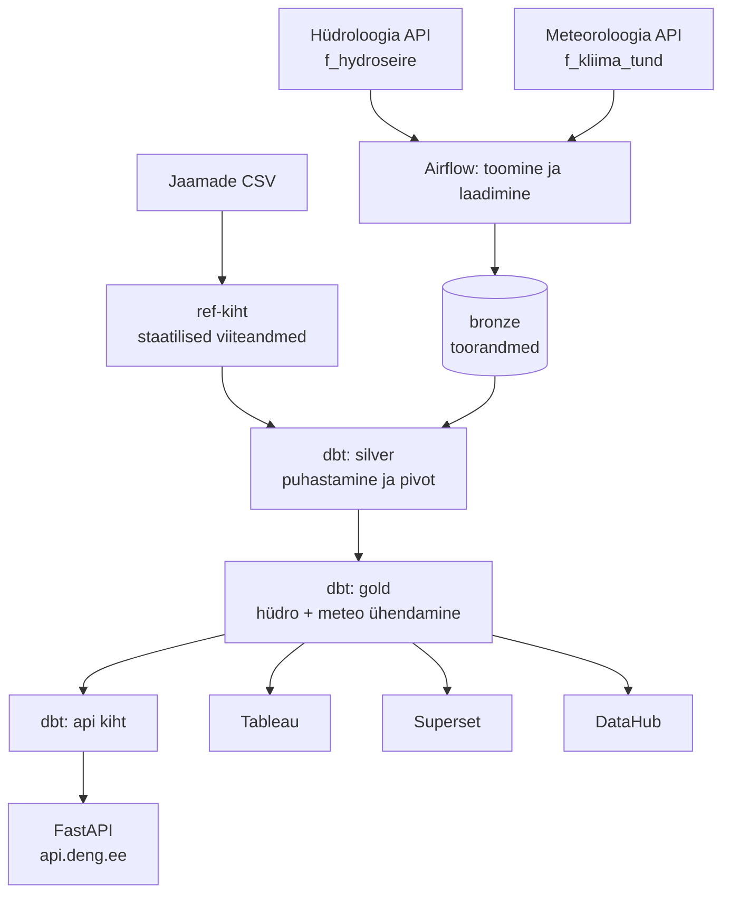

# [DENG]

## Äriküsimus

Kuidas mõjutavad sademed ja õhutemperatuur veetaseme kõikumisi seirejaamades ning millised keskkonnategurid (õhutemperatuur, sademed) avaldavad veetaseme muutusele kõige tugevamat mõju?

**Mõõdikud:**

1. **Veetase (cm)** hüdromeetriajaamade kaupa — keskmine, miinimum ja maksimum tunni kohta; EH2000 kõrgussüsteemiga korrigeeritud absoluutväärtus
2. **Sademete hulk (mm)** — lähima meteoroloogiajaama tunnipõhine mõõtmine; jaama lähedus arvutatud Haversine'i valemiga (top 3 lähimat)
3. **Muud ilmategurid** — õhutemperatuur, päikesepaiste kestus, suhteline niiskus, õhurõhk, tuule kiirus

## Arhitektuur



Täpsem kirjeldus: [`docs/school/arhitektuur.md`](docs/school/arhitektuur.md)

## Andmestik

| Allikas | Tüüp | Ajas muutuv? | Roll |
|---------|------|--------------|------|
| `f_hydroseire` (keskkonnaandmed.envir.ee) | REST API (PostgREST) | Jah, tunnipõhine (~43 h viivitus) | Veetase, veetemperatuur, äravool — 76 hüdromeetriajaama |
| `f_kliima_tund` (keskkonnaandmed.envir.ee) | REST API (PostgREST) | Jah, iga päev pakettöötlusena ~05:01 EET | Sademed, temperatuur, tuul, niiskus, päikesepaiste — 25 meteoroloogiajaama |
| `seeds/hydrometric_stations.csv` | CSV / seed | Ei, staatiline | 76 hüdrojaama metaandmed — koordinaadid, jõgikond, kõrgus MSL |
| `seeds/meteorological_stations.csv` | CSV / seed | Ei, staatiline | 25 meteoroloogiajaama metaandmed |
| Seirejaamade vahekaugus | Automaatselt genereeritud (Haversine) | Ei, uuendatakse muutuste korral | 228 paari — top 3 lähimat meteojaam iga hüdrojaama kohta |

## Stack

| Komponent | Tööriist | Versioon |
|-----------|----------|----------|
| Orkestreerimine | Apache Airflow (TaskFlow API) | 3.2.1 |
| Transformatsioon | dbt Core + dbt-utils | 1.9.x |
| Andmehoidla | PostgreSQL + pgduckdb | 16 |
| Avalik API | FastAPI + asyncpg + slowapi | 0.115.6 |
| Visualiseerimine | Apache Superset | 6.0.1 |
| Visualiseerimine | Tableau Public | — |
| Sisemine andmekataloog | DataHub | — |
| Avalik andmekataloog | CKAN | 2.11.4 |
| Konteinerid | Docker Compose | — |
| Pöördpuhverserver | Caddy (automaatne HTTPS) | — |

## Käivitamine

```bash
# 1. Klooni repo ja liigu kausta
git clone https://github.com/SyncMaster7/deng-hydro-climate.git
cd deng-hydro-climate

# 2. Kopeeri keskkonnamuutujad ja täida paroolid
cp .env.example .env
# Muuda .env failis kõik paroolid ja võtmed

# 3. Käivita kõik teenused
docker compose up -d --build

# 4. Käivita jaamade seed käsitsi (esimesel korral)
# Airflow UI-s: käivita seed_stations DAG käsitsi

# 5. Käivita pipeline käsitsi (esimesel korral)
# Airflow UI-s: käivita hydro_meteo_pipeline DAG käsitsi
```

| Teenus | Kohalik aadress | Avalik aadress |
|--------|-----------------|----------------|
| Airflow UI | http://localhost:8080 | https://airflow.deng.ee |
| Superset | http://localhost:8088 | https://superset.deng.ee |
| FastAPI dokumentatsioon | http://localhost:8000/docs | https://api.deng.ee/docs |
| CKAN andmekataloog | http://localhost:5000 | https://ckan.deng.ee |
| DataHub | http://localhost:9002 | https://datahub.deng.ee |

## Saladused ja konfiguratsioon

Kõik saladused (paroolid, API võtmed, andmebaasi ühendused) on `.env` failis. Repos on ainult `.env.example`, mis näitab vajalike muutujate struktuuri ilma tegelike väärtusteta. `.env` faili ei tohi GitHubi panna — see on `.gitignore`-s kirjas.

Vajalikud muutujad:

| Muutuja | Tähendus |
|---------|----------|
| `POSTGRES_PASSWORD` | Analüütika andmebaasi parool |
| `AIRFLOW_DB_PASSWORD` | Airflow metadata andmebaasi parool |
| `SUPERSET_DB_PASSWORD` | Superset metadata andmebaasi parool |
| `CKAN_DB_PASSWORD` | CKAN andmebaasi parool |
| `CKAN_ADMIN_PASSWORD` | CKAN administraatori parool |
| `AIRFLOW_ADMIN_PASSWORD` | Airflow administraatori parool |
| `SUPERSET_ADMIN_PASSWORD` | Superset administraatori parool |
| `DATAHUB_MYSQL_PASSWORD` | DataHub MySQL andmebaasi parool |

## Andmevoog lühidalt

1. **Toomine** — Airflow laadib iga päev hüdroloogilised ja meteoroloogilised andmed Keskkonnaagentuuri avalikust PostgREST API-st; kasutatakse 3-päevast puhvrit API avaldamisviivituse tõttu
2. **Laadimine** — Andmed laaditakse `bronze` kihti UPSERT-meetodiga; kõik etapid logitakse `bronze.etl_log` tabelisse
3. **Transformatsioon** — dbt puhastab ja pivoteerib andmed `silver` kihis; `gold` kihis ühendatakse hüdro- ja meteoroloogiaandmed lähima jaamapaari alusel; `api` kiht serveerib FastAPI-t
4. **Testimine** — 26 andmekvaliteedi testi käivituvad automaatselt iga `dbt build` jooksul; testi ebaõnnestumine peatab downstream mudelite ehitamise
5. **Avalikustamine** — FastAPI serveerib andmeid avaliku REST API-na aadressil `api.deng.ee`; Tableau ja Superset näidikulauad visualiseerivad analüüsi; CKAN ja DataHub haldavad metaandmeid

## Andmekvaliteedi testid

Projekt kontrollib andmekvaliteeti 26 automaatse dbt testiga bronze kihis. Testid jagunevad kuude dimensiooni järgi:

| # | Test | Kontroll | Dimensioon |
|---|------|----------|------------|
| 1–5 | `not_null` — hüdro võtmeväljad | `jaam_kood`, `timeline_ts_utc`, `timeline_ts_local`, `aegrida_nimi`, `loaded_at` ei ole tühjad | Täielikkus |
| 6–12 | `not_null` — meteo võtmeväljad | `jaam_kood`, `aasta`, `kuu`, `paev`, `tund`, `element_kood`, `loaded_at` ei ole tühjad | Täielikkus |
| 13 | `accepted_values` — `aegrida_nimi` | Ainult 9 teadaolevat hüdro mõõtmistüüpi | Õigsus |
| 14 | `accepted_values` — `element_kood` | Ainult 10 teadaolevat meteo elemendi koodi | Õigsus |
| 15 | `unique_combination_of_columns` — hüdro | `(jaam_kood, timeline_ts_utc, aegrida_nimi)` unikaalne | Unikaalsus |
| 16 | `unique_combination_of_columns` — meteo | `(jaam_kood, aasta, kuu, paev, tund, element_kood)` unikaalne | Unikaalsus |
| 17 | `bronze_hydro_wl_range` | Veetase -100 kuni 1500 cm | Õigsus |
| 18 | `bronze_hydro_wt_range` | Veetemperatuur -5 kuni 35 °C | Õigsus |
| 19 | `bronze_hydro_discharge_range` | Äravool -300 kuni 15 000 m³/s | Õigsus |
| 20 | `bronze_hydro_no_future_timestamps` | `timeline_ts_utc` ei tohi olla tulevikus | Õigsus |
| 21 | `bronze_meteo_temperature_range` | Õhutemperatuur -40 kuni 35 °C | Õigsus |
| 22 | `bronze_meteo_precipitation_non_negative` | Sademed ≥ 0 mm | Õigsus |
| 23 | `bronze_meteo_humidity_range` | Suhteline niiskus 0–100% | Õigsus |
| 24 | `bronze_meteo_pressure_range` | Õhurõhk 950–1060 hPa | Õigsus |
| 25 | `bronze_meteo_wind_speed_non_negative` | Tuule kiirus ≥ 0 m/s | Õigsus |
| 26 | `bronze_meteo_tund_range` | Tund 0–23 | Vorming ja kehtivus |

Testitulemused on nähtavad Airflow UI-s `run_dbt` ülesande logides ning DataHub andmekataloogis bronze kihi varadel.

## Projekti struktuur

```
.
├── README.md
├── compose.yml
├── .env.example
├── .gitignore
├── dbt_project/            ← dbt mudelid (bronze/silver/gold/api)
│   ├── models/
│   ├── tests/
│   └── seeds/
├── dags/                   ← Airflow DAGid
├── docker/                 ← Dockerfile'id (FastAPI, CKAN jm)
├── sql/                    ← migratsiooni- ja seadistuse SQL
├── datahub/                ← DataHub ingestion retseptid ja artefaktid
└── docs/
    ├── architecture.md     ← ingliskeelne tehniline arhitektuur
    ├── progress.md         ← ingliskeelne edenemisraport
    ├── runbook/            ← operatsioonijuhendid
    └── school/
        ├── arhitektuur.md  ← 1. nädala koolidokument
        └── progress.md     ← 2. nädala koolidokument
```

## Kokkuvõte, puudused ja võimalikud edasiarendused

**Kokkuvõte:**
- Täielik andmepipeline töötab tootmiskeskkonna sarnaselt — allikast avaliku API-ni
- Igapäevane automatiseeritud andmete toomine, laadimine, transformatsioon ja kvaliteedikontroll
- Avalik REST API (`api.deng.ee`) koos kiiruspiirangu, jälgimise ja OpenAPI dokumentatsiooniga
- DataHub sisemine andmekataloog täieliku andmeliiniga (bronze → silver → gold → Superset)
- CKAN avalik metaandmekataloog DCAT-AP 3 toega
- 26 automaatset andmekvaliteedi testi, mis peatavad vigaste andmete leviku transformatsioonikihti
- Tableau analüüsinäidikulaud (Thea) ja Superset monitooringnäidikulaud (Kermo)

**Puudused:**
- dbt testid katavad praegu ainult bronze kihti — silver, gold ja api kihtide testid on planeeritud, kuid teostamata
- DataHub metaandmete rikastamine (kirjeldused, ärikontekst DCAT-AP alusel) on pooleli
- Superset analüüsinäidikulauad on planeeritud, kuid veel ehitamisel — põhinevad `gold.hydro_meteo_daily` mudelil, mis eeldab täiendavat dbt arendust
- CKAN-i andmekogud viitavad praegu üldisele Keskkonnaagentuuri portaalile, mitte veel konkreetselt projekti FastAPI endpointidele

**Mis edasi:**
- Korrelatsioonanalüüsi näidikulauad Supersetis (Pearson ja Spearman kõrvuti) — eesmärk vastata äriküsimusele kvantitatiivselt
- dbt testide laiendamine silver, gold ja api kihtidele
- DataHub metaandmete täielik rikastamine DCAT-AP standardi järgi
- Riikliku avaandmete portaali (avaandmed.eesti.ee) esitamisprotsessi uurimine — CKAN on loomulik sild, kuna ka riiklik portaal töötab CKAN-il

## Meeskond

| Nimi | Roll | Panus |
|------|------|-------|
| Thea | Projektikoordineerimine, visualiseerimine | Projektijuhtimine, Tableau analüüsinäidikulaud |
| Kairi | Metodoloogia, dokumentatsioon | Projekti struktuur, nõuete analüüs, dokumentatsioon |
| Anny | Ärianalüüs, andmehaldus | DataHub administreerimine, andmekirjeldused ja sõnastikud |
| Aivo | Andmejuhtimine, metaandmed | Andmehalduse protsessid, metaandmete standardid, DataHub kasutuselevõtt |
| Kermo | Tehniline infrastruktuur, backend | Docker, Airflow, dbt, FastAPI, PostgreSQL, CKAN, DataHub integratsioonid |

---

*Andmed: Keskkonnaagentuuri avalik API (CC BY 4.0) · Projekt ei sisalda isikuandmeid*
